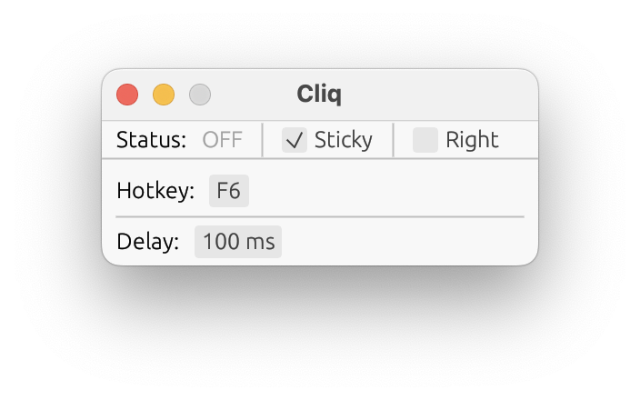
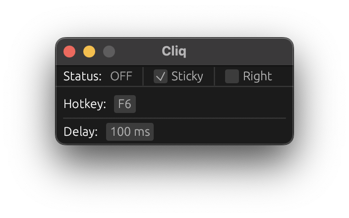

# Cliq

<div align="center">
  
</div>

Cliq is a simple cross-platform Rust autoclicker with global hotkey and always on top support. I couldn't find any good autoclickers for Mac (without unnecessary features), so I decided to make my own with the features I needed

Cliq is inherently feature-limited, and is not intended to be a "full-featured" autoclicker—it's designed to be lean. Unless someone requests a feature, then I might add it.

Thanks to [egui](https://github.com/emilk/egui) for the GUI, it looks good on all platforms and respects the system theme.

## Screenshots

I'm too lazy to take screenshots on all platforms, so here's what it looks like on macOS (light/dark mode):

| Light                        | Dark                       |
| ---------------------------- | -------------------------- |
|  |  |

## Installation

You can build Cliq from the source, I'm too lazy to make binary releases for now.

```bash
git clone https://github.com/durocodes/cliq
cd cliq
cargo build --release
```

Then you'll find the binary in `./target/release/cliq`. If you want to run it without the termial (for macOS), you can make an app bundle, you can use platypus or something similar, but you can do that manually.
